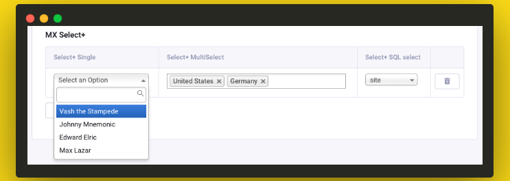

# MX Select Plus
This add-on makes long, unwieldy select boxes much more user-friendly with Chosen plugin. It is also opens the option to the user to add new items into the list "on the fly". You can setup to save new options on field level (to be available for choosing in all entrees) or just once. Support Matrix-like fields, Low Variables, SafeCracker. And you can also populate list with custom SQL queries.

## Compatibility
* ExpressionEngine 6
* ExpressionEngine 5
* ExpressionEngine 4
* ExpressionEngine 3
* ExpressionEngine 2

* Channel Form
* Low Variables
* Matrix
* Grid
* Better Workflow

##Installation
* Download the latest version of MX Select Plus and extract the .zip to your desktop.
* Copy *system/user/third_party/mx_select_plus* to *system/expressionengine/third_party/*
* Copy *themes/third_party/mx_select_plus* to *themes/third_party/*

mx-select-plus.png

## Activation
* Log into your control panel
* Browse to Addons > Fieldtypes
* Enable all the MX Select Plus CE components

## Field settings

### Placeholder

Default field text If no placeholder value is present, it will default to "Select Some Option" or "Select Some Options" depending on whether the select is single or multiple

### Multi

Is multeselect is available

### Allow user to add to list on the fly?

**No** is not available
**Yes** is available, update will be do on the field level and will be available in another entries.
**One time** users can add new options but they will be only available in current entry. If user deselected such option, option will be deleted after entry update.

### Minimum width of element?

Width of element

### Items

Default options.

**DB Request** Populate list with custom SQL queries.

## Templates Variables

    <ul>
    {exp:channel:entries channel="demo" limit = "1"}
        {country}
            <li>{option} => {option_name} </li>
        {/country}
    {/exp:channel:entries}
    </ul>

### Parameters

#### sort

    sort="asc" sort="desc"
    
The sort order can be ascending or descending.

#### limit

    limit="10"
    
#### backspace
    backspace="10"
    
Backspacing removes characters (including spaces and line breaks) from the last iteration of the loop.

#### offset
    offset="1"
This parameter offsets the display by X number of results.

#### all_options
    <ul>
    {exp:channel:entries channel="demo" limit = "1"}
        {country list = 'on'}
            <li {if "{selected}"}class= "selected"{/if}> {option_name}</li>
        {/country}
    {/exp:channel:entries}
    </ul>

Return all options for field.

### Single Variables

#### option
    {option} 
The current option

#### option_name
    {option_name} 
You can used it If you have name for options.

#### count
The “count” out of the current entries being displayed. If five entries are being displayed, then for the fourth entry the {count} variable would have a value of “4”.

#### total_results
The total number of entries being displayed.

#### selected
    {selected} 
You can used it with parameter all_options. It’s helps to indicate parameters which was chosen.

#### :ol

    {exp:channel:entries channel="demo" limit = "1"}
    {country:ol}
    {/exp:channel:entries} 
Returns an ordered list

#### :ul

    {exp:channel:entries channel="demo" limit = "1"}
    {country:ul}
    {/exp:channel:entries} 
Returns an unordered list

## Support Policy

This is Communite Edition  add-on.

## Contributing To MX Select Plus

Your participation to MX Select Plus development is very welcome!

You may participate in the following ways:

* [Report issues](https://github.com/MaxLazar/mx-select-plus/issues)
* Fix issues, develop features, write/polish documentation
Before you start, please adopt an existing issue (labelled with "ready for adoption") or start a new one to avoid duplicated efforts.
Please submit a merge request after you finish development.

### License

The MX Select Plus CE is open-sourced software licensed under the [MIT license](http://opensource.org/licenses/MIT)
